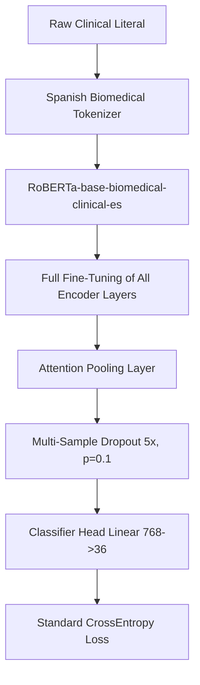

# ICD-10 Clinical Codification Classification Pipeline

This repository contains an end-to-end clinical text codification pipeline in Spanish. The task is formulated as a single-label multiclass classification problem, mapping short clinical report literals to their corresponding first-character ICD-10 chapter (**36 classes**: `0-9`, `A-Z`).

---

## 1. Dataset Characteristics & Key Statistics

The dataset presents several distinct machine learning challenges:
* **Severe Class Imbalance:** The corpus is dominated by a few common diagnostic categories (such as `Z`, `O`, and `0`), while long-tail clinical conditions (e.g., `W` or `X`) contain only a handful of examples.
* **Short Literal Lengths:** Clinical reports are extremely brief—averaging only 16.9 characters (2.2 words) per sample, with a median word count of 2.0.
* **Corpus Scale:** Total of 13,700 samples across the 36 alphanumeric chapters. The maximum class imbalance ratio is **245.0x** (Chapter `Z` has 1,715 samples, whereas Chapter `W` has only 7).

---

## 2. Model Architecture

The deep learning model is implemented in PyTorch and fine-tunes a pre-trained clinical transformer:

### A. Pre-trained Backbone
We use `PlanTL-GOB-ES/roberta-base-biomedical-clinical-es`, which was pre-trained on 1B+ tokens of Spanish biomedical literature, SciELO papers, clinical notes, and medical registries. All layers are fully fine-tuned during training.

### B. Custom Attention Pooling
To capture localized features in short literals, the hidden states from the transformer backbone are pooled using a learnable attention mechanism:
* Passes hidden states through a linear projection layer and a `Tanh` activation.
* Masks out padding tokens with $-\infty$ so they receive zero weight during softmax.
* Computes a weighted sum over the sequence length, ignoring fillers and focusing on diagnostic clinical tokens.

### C. Multi-Sample Dropout
To prevent overfitting on the clinical literals, the pooled representations are passed through **5 parallel dropout paths** ($p=0.1$) with different random masks. The resulting logits are averaged before classification.

---

## 3. Training Configurations & Hyperparameters

* **Optimizer:** AdamW with a flat learning rate of $2 \times 10^{-5}$ and weight decay of $0.01$.
* **Learning Rate Scheduler:** Cosine annealing with a 10% warmup phase.
* **Gradient Accumulation:** Physical batch size of 16 is accumulated over 8 steps to simulate a stable **128 effective batch size**.
* **Loss Function:** Standard Cross Entropy Loss (`nn.CrossEntropyLoss()`).
* **Early Stopping:** Evaluates on validation accuracy with a patience of 10 epochs.

---

## 4. Quantitative Results

Both the deep learning classifier and the baseline model were evaluated on a stratified 80/20 train/validation split (using random seed 42) for a rigorous comparison.

* **Baseline Model:** A Scikit-Learn `Pipeline` using a `FeatureUnion` of character-level TF-IDF (3-5 n-grams) and word-level TF-IDF (1-2 n-grams) paired with a multinomial Logistic Regression.

### Performance Summary

| Metric | TF-IDF + Logistic Regression | RoBERTa + Attention Pooling | Delta ($\Delta$) |
| :--- | :---: | :---: | :---: |
| **Accuracy** | 52.99% | **57.01%** | **+4.02%** |
| **Macro-$F_1$** | 44.49% | **49.42%** | **+4.93%** |
| **Weighted-$F_1$** | 51.04% | **55.07%** | **+4.03%** |

*The deep learning model delivers substantial gains over the baseline, particularly in Macro-$F_1$ (+4.93\%), reflecting a much stronger ability to classify minority and long-tail categories.*

---

## 5. Repository File Structure

* **`icd10_pipeline.py`**: The primary end-to-end PyTorch deep learning script containing model definition, dataset loading, training loops, evaluation metrics, and test-set inference generation.
* **`eda_analysis.py`**: Exploratory data analysis script that analyzes dataset lengths, prints imbalance metrics, and outputs distribution plots (`eda_class_distribution.png`, `eda_text_length_distribution.png`).
* **`baseline_tfidf.py`**: Evaluates and fits the TF-IDF + Logistic Regression pipeline, outputting the baseline classification report and comparative summaries.
* **`error_analysis.py`**: Restores `best_model.pt` and evaluates validation set predictions to output a normalized confusion heatmap (`error_confusion_matrix.png`), top 15 error pairs (`error_top_confusions.png`), and qualitative error logs.
* **`report.tex`**: The LaTeX source code of a comprehensive technical report compiled from all project findings.
* **`dl_val_metrics.json`**: Cached validation results from the deep learning model.
* **`baseline_classification_report.txt`**: Standard classification report details of the TF-IDF baseline.
* **`baseline_vs_dl_comparison.txt`**: Plaintext summary table showing baseline vs. deep learning metrics side-by-side.
