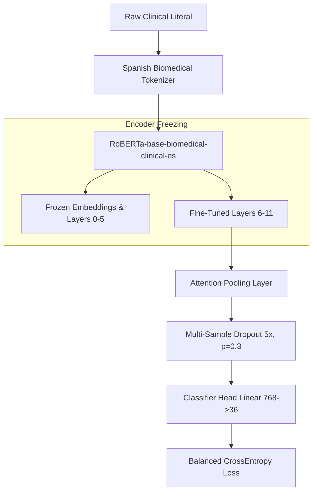

# ICD-10 Clinical Codification Classification Pipeline

This repository contains an end-to-end deep learning pipeline for Spanish clinical text codification. The task is formulated as single-label multiclass classification, mapping raw clinical report literals to their corresponding first-character ICD-10 category (**36 classes**: `0-9`, `A-Z`).

---

## 1. Dataset Characteristics & Challenges

The dataset presents several distinct machine learning challenges:
1. **Severe Class Imbalance**: Primary training data is dominated by a few common diagnostic categories (such as `Z`, `O`, and `0`), while long-tail clinical conditions (e.g. `U` or `W`) contain only a handful of examples.
2. **Domain Mismatch**: The pipeline relies on two data sources:
   - **Primary Dataset (`codification_data.csv`)**: Raw, short clinical report literals containing misspellings, colloquial phrasing, and medical abbreviations (e.g. *"HTA irc 6"*, *"miomas parto"*).
   - **Augmentation Dataset (`icd_d_p_pairs.csv`)**: Clean, formal ICD-10 dictionary descriptions (e.g. *"Colera debido a Vibrio cholerae..."*).
3. **Short Literal Lengths**: Real clinical reports are brief—averaging only 2 to 3 words, and peaking at 9 words. Standard dictionary terms peak around 35 words.

---

## 2. Overall Pipeline Workflow

1. **Light Preprocessing**: Casts inputs to strings, strips whitespace, and resolves multiple spaces into a single space. Accent marks, punctuation, and character casing are preserved intact so the tokenizer can extract semantic signals.
2. **Stratified Split-Before-Augment**: The primary clinical reports are split into an 80% training set and a 20% validation set using stratified splitting (preserving class proportions). The validation split is kept completely clean. Standard ICD-10 dictionary entries (`icd_d_p_pairs.csv`) are combined **only** with the training split to prevent data leakage.
3. **Tokenization & Datasets**: Text sequences are mapped to subword IDs using the pre-trained Spanish biomedical tokenizer. Sequence lengths are capped at 128.
4. **Deep Learning Model**: Batches are processed through a Spanish-specific pre-trained RoBERTa backbone, pooled using a custom attention layer, regularized with Multi-Sample Dropout, and passed to a linear classification head.
5. **Loss & Backpropagation**: Gradient updates are computed using CrossEntropyLoss with balanced class weights and label smoothing.

---

## 3. Architecture & Design Decisions

Every component of the network is tailored to Spanish clinical text and the specific data constraints:

### A. Pre-trained Backbone: `PlanTL-GOB-ES/roberta-base-biomedical-clinical-es`
* **Why**: Standard multilingual models (e.g., multilingual BERT) are trained on general web corpora (like Wikipedia). They struggle with Spanish clinical acronyms (like *HTA*, *IRC*, *VHC*), abbreviations, and specific diagnostic idioms. This backbone was pre-trained on 1B+ tokens of Spanish biomedical literature, SciELO papers, clinical notes, and medical registries, providing it with pre-built clinical representations.

### B. Custom Attention Pooling
* **Why CLS/Mean is sub-optimal**: Standard CLS pooling relies on a single sequence-start token (`<s>`), which is trained during Masked Language Modeling to summarize general context but can fail to capture localized features in short literals. Mean pooling treats all tokens equally, giving the same weight to filler words (prepositions, articles) as to diagnostic words.
* **How it works**: Attention pooling passes the RoBERTa hidden states through a small linear projection network, learning to output a relevance score for each subword. Padding tokens are masked with negative infinity (`-inf`), and scores are softmaxed to weight the final summation. This forces the model to focus its attention on core clinical terms (like *"dilatada"* or *"bronquial"*) while ignoring surrounding text.

### C. Multi-Sample Dropout (5x, `p = 0.3`)
* **Why**: Overfitting is a primary concern with small medical datasets.
* **How it works**: Instead of using a single dropout layer, the pooled representation is cloned and passed through 5 parallel dropout paths. Each path uses a different random mask. The model averages the 5 sets of classifier logits. During training, this acts as a robust ensemble regularizer, accelerating convergence and preventing the classifier head from co-adapting to specific words in the training set.

---

## 4. Advanced Training Regularization

To enable stable convergence and prevent overfitting, the pipeline incorporates the following training parameters:

* **Encoder Layer Freezing**: Embeddings and the bottom 6 layers of the RoBERTa encoder are frozen. Only the top 6 transformer layers, the attention pooling weights, and the classification head are trained. This significantly reduces the trainable parameter count (from 126M down to ~43.7M) and prevents the base layers from losing general clinical features.
* **Differential Learning Rates**: 
  - Backbone parameters are fine-tuned at a very conservative rate: **$5 \times 10^{-6}$**.
  - The pooling and classification heads (which are initialized from scratch) are trained at a higher rate: **$3 \times 10^{-5}$**.
* **Balanced Class Weights**: Class weights are calculated inversely proportional to class frequencies. This prevents the loss calculation from being dominated by major categories (like class `0`), ensuring the model remains highly sensitive to minority diagnoses.
* **Label Smoothing (0.1)**: Distributes 10% of the target probability uniformly across all incorrect classes. This prevents the model from generating overconfident, saturated logit predictions and encourages it to maintain soft boundaries, which improves generalization.
* **Gradient Accumulation**: To maintain a large **128 effective batch size** (as required to stabilize optimization on highly imbalanced targets) on consumer-grade GPUs, we use a physical GPU batch size of 16 and accumulate gradients over 8 steps.
