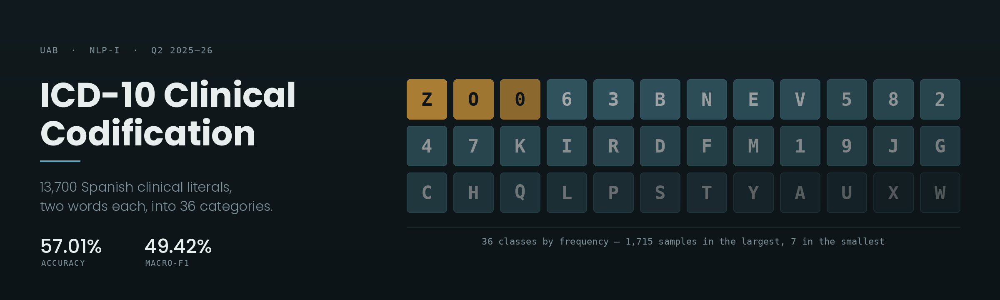
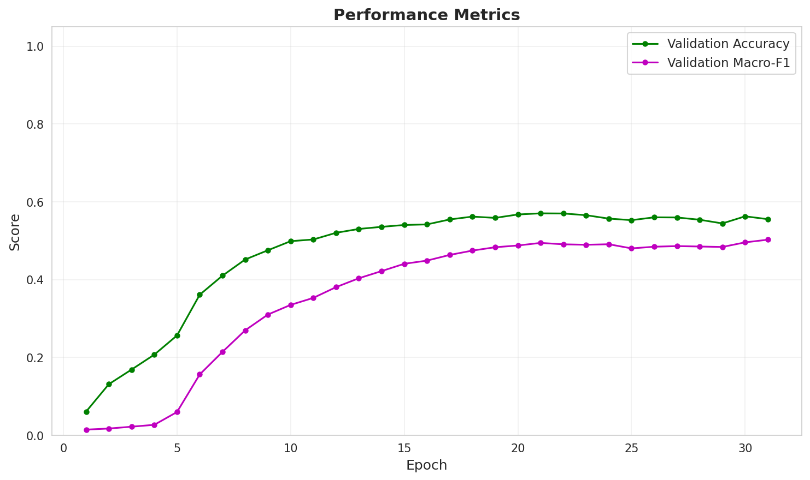
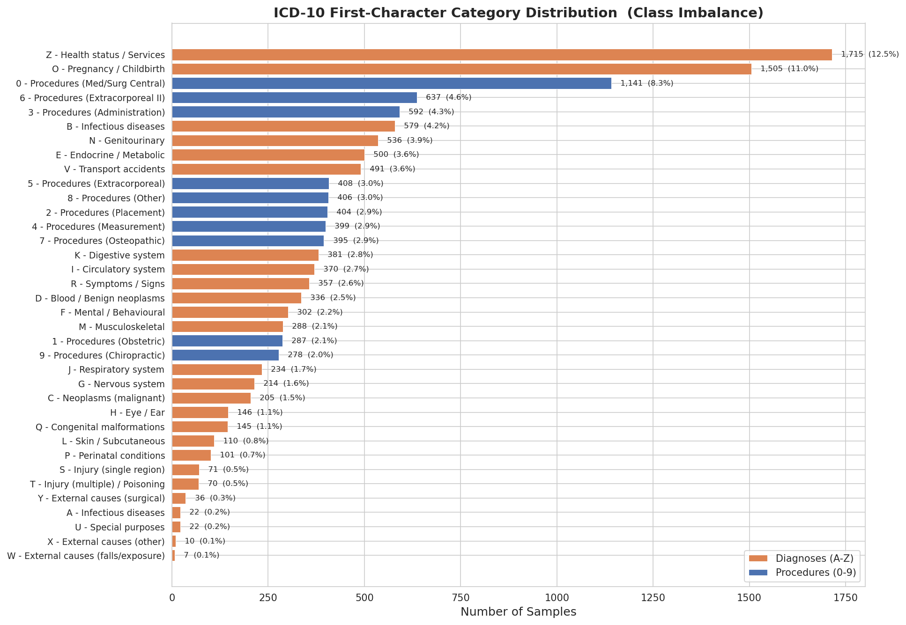
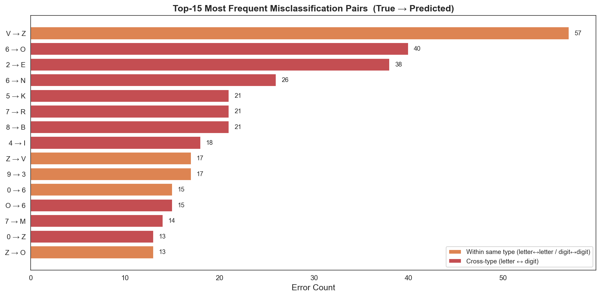

# ICD-10 Clinical Codification

Assigning ICD-10 categories to Spanish clinical literals — short, noisy fragments written by
hospital staff, averaging two words each. A domain-pretrained RoBERTa encoder with learned
attention pooling and multi-sample dropout, measured against a TF-IDF baseline on the same split.

NLP-I coursework, Universitat Autònoma de Barcelona, Q2 2025–26. Challenge set by ASHO.

## Results

Both models were trained and evaluated on the same 80/20 stratified split of 13,700 real clinical
literals. The transformer uses an unweighted cross-entropy loss so the comparison isolates the
architecture rather than the loss function.

| Metric | TF-IDF + Logistic Regression | RoBERTa + Attention Pooling | Δ |
| :--- | ---: | ---: | ---: |
| Accuracy | 52.99% | **57.01%** | +4.02 |
| Macro-F1 | 44.49% | **49.42%** | +4.93 |
| Weighted-F1 | 51.04% | **55.07%** | +4.03 |

Exact figures in [`outputs/dl_val_metrics.json`](outputs/dl_val_metrics.json) and
[`outputs/baseline_vs_dl_comparison.txt`](outputs/baseline_vs_dl_comparison.txt).

Macro-F1 is the metric to read here. The label distribution is long-tailed enough that accuracy
mostly measures performance on three classes, so a model can look competent while never learning
the tail at all. The largest gain is on Macro-F1, which is the result worth having.



Validation Macro-F1 keeps climbing for roughly twenty epochs after accuracy has flattened — the
tail improves long after the head has converged. Validation loss turns upward around epoch 20 while
training loss keeps falling, so early stopping is what keeps these numbers honest.

## The task

Each input is a raw clinical literal. The target is the first character of its ICD-10 code —
36 classes, where letters `A`–`Z` are diagnoses and digits `0`–`9` are procedures.

| Literal | Code | Target |
| :--- | :--- | :--- |
| `Hiperreactividad bronquial` | J9809 | `J` |
| `miocardiopatía dilatada` | I420 | `I` |
| `HTA irc 6` | — | `I` |

Four properties of the data drive every design decision below.

**The inputs are extremely short.** Mean length is 16.9 characters and 2.2 words; the longest
literal in the corpus is 9 words. There is very little context to condition on and no document
structure to fall back on.

**The label distribution is severely long-tailed.** `Z` (health status) accounts for 1,715 samples,
`O` (pregnancy) 1,505 and `0` (medical and surgical procedures) 1,141 — together about a third of
the corpus. At the other end, `W` has 7 examples, `X` has 10, and `A` and `U` have 22 each.



**The label space mixes two coding systems.** Letters come from ICD-10-CM diagnoses, digits from
ICD-10-PCS procedures. They describe genuinely different things, and most of the model's residual
errors cross that boundary.

**The text is real clinical writing.** Misspellings, abbreviations and clipped phrasing throughout
(`HTA` for hypertension, `irc` for chronic renal insufficiency), which is what makes a
general-purpose Spanish model a poor starting point.

## Approach

```
literal → biomedical tokenizer → RoBERTa-base → attention pooling → 5× dropout → 5 linear heads
          (128 tokens)            (128 × 768)     (1 × 768)          (p = 0.1)     (mean of logits)
```

### Domain-pretrained backbone

`PlanTL-GOB-ES/roberta-base-biomedical-clinical-es`, pretrained on Spanish biomedical literature,
SciELO papers and clinical notes. Multilingual models trained on general web text have no useful
representation for `HTA`, `IRC` or `VHC`, and with a two-word input there is no surrounding context
from which to recover the meaning. The backbone has to already know the vocabulary.

### Attention pooling instead of CLS or mean

CLS pooling reads the whole sequence off a single position that masked-language-model pretraining
optimised for general context, not for localised diagnostic terms. Mean pooling weights every token
equally, so in `paciente con fractura severa en el brazo izquierdo` the prepositions count as much
as `fractura`.

Attention pooling passes the hidden states through a small linear scorer, masks padding positions
with `-inf`, softmaxes over the sequence and returns the weighted sum. The model learns which
tokens carry the diagnosis. On inputs this short, that is most of the available signal.

### Multi-sample dropout

The pooled vector goes through 5 parallel dropout masks (`p = 0.1`) into 5 linear heads, and the
logits are averaged. It behaves as an ensemble inside a single forward pass: cheap, and it reduces
the variance a single mask introduces on classes with a handful of examples.

### Training configuration

| | |
| :--- | :--- |
| Split | 80/20 stratified, real clinical literals only, no augmentation |
| Optimiser | AdamW, lr 2e-5, weight decay 0.01, cosine schedule with 10% warmup |
| Batch | 16 physical × 8 accumulation steps = 128 effective |
| Sequence length | 128 tokens |
| Precision | fp16 automatic mixed precision |
| Trainable | all 126M parameters |
| Loss | cross-entropy, unweighted |
| Early stopping | patience 10 on validation accuracy |
| Seed | 42, with cuDNN determinism enabled |

The loss is deliberately unweighted. Class weighting would have improved Macro-F1, but the point of
this run is a like-for-like comparison against the TF-IDF baseline, and changing the loss at the
same time as the architecture would have made the delta unattributable.

## Error analysis



The most frequent confusions are `V → Z` (57), `6 → O` (40), `2 → E` (38) and `6 → N` (26). Most of
the top-15 error pairs cross the letter/digit boundary, meaning the model is confusing a procedure
with the diagnosis that motivated it — `6` (extracorporeal procedures) predicted as `O` (pregnancy)
is a plausible mistake for a literal that mentions both. Telling them apart requires knowing whether
the note records what the patient has or what was done to them, which two words often do not say.

The full 36×36 normalised confusion matrix is in
[`outputs/error_confusion_matrix.png`](outputs/error_confusion_matrix.png).

## Limitations

The rare classes are the weak point, and that matters more than the aggregate number suggests: rare
conditions are where coding errors carry the most clinical and administrative cost, and the tail of
this distribution is not randomly spread across patients. The training data reflects common
presentations in the Catalan hospital system, so anything unusual is underrepresented by
construction.

I would not read 57% as a ceiling on the task so much as a ceiling on the input. Two words with no
patient context is a hard constraint; the informative next step is more context per record, not a
larger model.

## Repository

```
src/
  icd10_pipeline.py            reference pipeline — produces the reported results
  icd10_pipeline_optimized.py  6 GB VRAM variant with class weighting and augmentation
  baseline_tfidf.py            TF-IDF + logistic regression baseline
  eda_analysis.py              class and text-length distributions
  error_analysis.py            confusion matrix, top confusion pairs, exact metrics
data/
  codification_data.csv        13,700 labelled clinical literals
  icd_d_p_pairs.csv            ICD-10 dictionary descriptions (augmentation source)
  leaderboard_data.csv         6,667 unlabelled test literals
  submission.csv               predictions on the test set
outputs/                       figures, metrics and reports produced by the scripts above
docs/
  report.pdf                   full write-up
  report.tex                   LaTeX source
  presentation.pdf             slides from the defence
  hero.png                     banner above
```

### The optimized pipeline

`icd10_pipeline_optimized.py` is the same model fitted into 6 GB of VRAM, with deliberate changes
rather than pure downscaling:

- Embeddings and the bottom 6 encoder layers frozen; sequence length cut to 64 (the longest literal
  tokenises to 49); batch 32 × 4 accumulation.
- Balanced class weights on the loss, and early stopping switched from accuracy to Macro-F1.
  Stopping on accuracy halts training once the majority classes converge, which is exactly when the
  tail is still improving.
- Training data augmented with formal ICD-10 dictionary descriptions from `icd_d_p_pairs.csv`,
  capped at 1,000 per class. The split happens **before** augmentation, so validation stays entirely
  real clinical text. Dictionary entries are clean and average around 35 words; mixing them into
  validation would measure performance on a distribution that does not exist in deployment.

## Running it

```bash
git clone https://github.com/pscxgpt/icd10-clinical-coding.git
cd icd10-clinical-coding
python -m venv .venv && source .venv/bin/activate   # Windows: .venv\Scripts\activate
pip install -r requirements.txt

python -m src.eda_analysis        # class and length distributions
python -m src.baseline_tfidf      # TF-IDF baseline
python -m src.icd10_pipeline      # the transformer — writes submission.csv and curves
python -m src.error_analysis      # confusion matrix and metrics, needs a trained model
```

Install the PyTorch build matching your CUDA version first — see
[pytorch.org/get-started](https://pytorch.org/get-started/locally/). Everything is written into
`outputs/`. On a laptop RTX 3050 run `python -m src.icd10_pipeline_optimized` instead; the reference
pipeline will not fit in 6 GB.

Training runs about 30 epochs before early stopping triggers. Model weights are not committed, so
`error_analysis.py` needs a completed training run first.

## Documents

The full write-up is [`docs/report.pdf`](docs/report.pdf), with the LaTeX source alongside it.
[`docs/presentation.pdf`](docs/presentation.pdf) is the defence deck — it carries the architecture
diagram, the attention-pooling comparison and the multi-sample dropout schematic in a form that is
quicker to read than the report.

## Notes

The dataset was provided by the course and is included here alongside the report. The challenge
brief and the literature survey used while writing the report are not redistributed.
